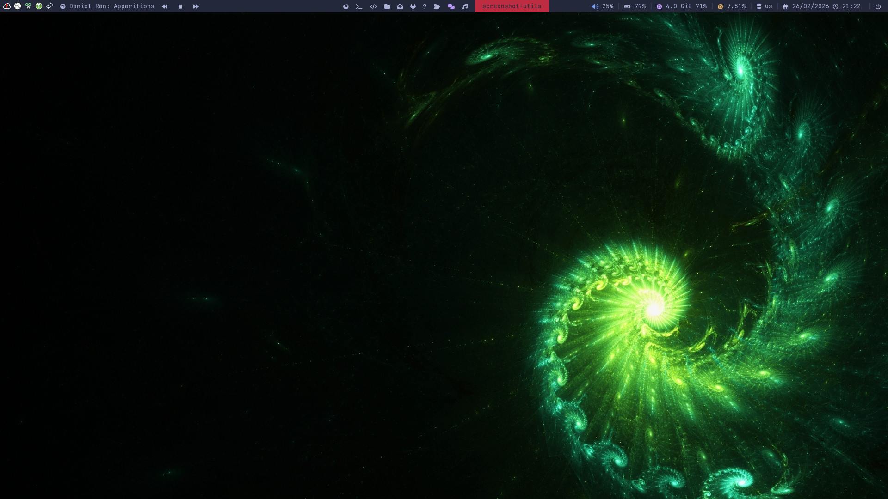

# My Dotfiles



A collection of configuration files for my Linux setup, focused on a lightweight and efficient workflow. 

## Highlights

- **Window Manager:** [i3-gaps/i3](https://i3wm.org/) (Based on EndeavourOS configuration)
- **Shell:** [Fish](https://fishshell.com/) with custom functions, completions, and handy abbreviations.
- **Terminal:** [Kitty](https://sw.kovidgoyal.net/kitty/) configured with the One Dark theme and Fish as the default shell.
- **Status Bar:** [Polybar](https://github.com/polybar/polybar) featuring custom scripts for CPU, memory, media playing (MPRIS), and calendar popups.
- **Application Launcher:** [Rofi](https://github.com/davatorium/rofi) styled with Arc Dark colors.
- **Notifications:** [Dunst](https://dunst-project.org/)
- **AUR Helper:** [Yay](https://github.com/Jguer/yay)

## Structure

- `.config/i3/` - Core window manager configuration, keybindings, and startup scripts.
- `.config/fish/` - Shell setup, aliases/abbreviations (for `git`, `docker`, `yadm`, `pacman`, etc.).
- `.config/polybar/` - Status bar layout and custom modules.
- `.config/kitty/` - Terminal emulator settings and theming.
- `.config/rofi/` - Application launcher, powermenu, and keyhint scripts.
- `.config/dunst/` - Notification daemon configuration.

## Installation

```bash
yadm clone git@github.com:nav1s/dotfiles
```
